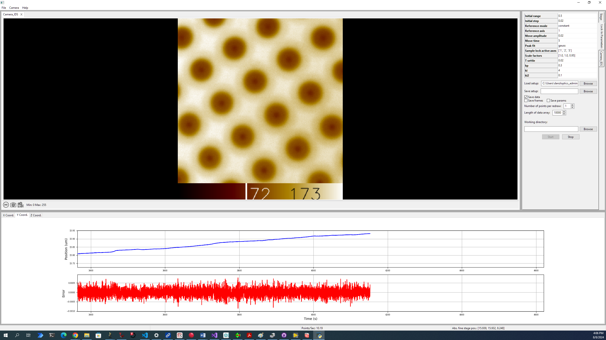

# Sample Lock

## Description
This is a software application designed to provide a graphical user interface (GUI) for an image-based sample stabilization scheme for microscopy developed in the Danzl lab and published at ***insert link***. This software module integrates hardware control and data processing functionalities, offering a robust solution for researchers requiring precise sample stabilization in microscopy applications.

## Visuals

This screenshot displays an example stabilization measurement using the samplestabilization software. The main panel presents an image of the structure used for stabilization. Below this, two graphs offer real-time monitoring of 3-axis stabilization data: the upper graph displays the position of the piezo stage along a single axis (blue line), and the lower graph illustrates the computed discrepancies between actual sample position and setpoint along that axis (red line). To the right, the "Stage" tab allows for positioning of the sample using both coarse (motor stage) and precise (piezo stage) movements before the feedback is engaged. The "Feedback parameters" tab contains fields for setting all relevant parameters, alongside options to save data and adjust plotting settings. Camera regions of interest and exposure time can be set in the "Camera" tab.

## Prerequisites
Before installing, ensure you have the following prerequisites installed:
- Python 3.9 or higher
- Camera Drivers:
    -   Andor Camera Drivers: Required for operating Andor cameras. Available through [Andor's website](https://andor.oxinst.com/products/).
    -   IDS Camera Drivers: Necessary for integrating IDS cameras. Download from [IDS's official site](https://en.ids-imaging.com/).
- Stage Drivers:
    - Thorlabs Drivers: For controlling Thorlabs stages, install the appropriate drivers from Thorlabs' support page.
    - PI Drivers: Access the drivers at PI's download section.
  
Software was tested on a PC running Windows 10 (Version 10.0.19045 Build 19045).

## Installation

To get started with this project, clone the repository and install the required dependencies:

```bash
git clone git@github.com:danzllab/samplestabilization.git
cd samplestabilization
pip install -r requirements.txt
```

## Features
- Multiple Camera Support: Readily compatible with IDs and Andor camera models, can be easily extended.
- Stage Control: Fine and coarse control of motorized stages with precision settings.
- Real-time Data Processing: Live data visualization and error handling for real-time performance monitoring.
- Extensive Configuration: Easy to configure system parameters through a GUI interface or configuration files.

## License
This project is licensed under the GNU Affero General Public License (GNU AGPLv3) - see the LICENSE.md file for details. Copyright holder: Institute of Science and Technology Austria.
